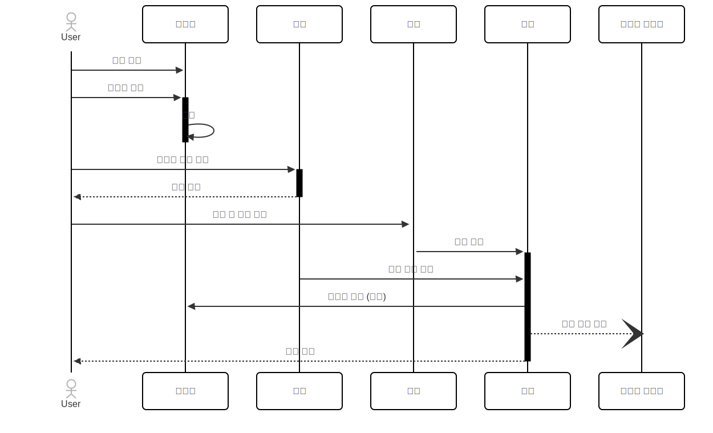

## E-COMMERCE SERVICE 프로젝트


## [ERD](https://dbdiagram.io/d/e-commerce-68380c69c07db17e77ae5bb5)


## Sequence Diagram: Order

<!-- [sequence diagram](https://www.mermaidchart.com/app/projects/6f39329d-4391-4d2d-914a-01cfe219716d/diagrams/5be8f6dc-8226-4a63-8504-116b09106ebd/version/v0.1/edit) -->

## Infrastructure diagram


<!-- 
### Prerequisites

#### Running Docker Containers

`local` profile 로 실행하기 위하여 인프라가 설정되어 있는 Docker 컨테이너를 실행해주셔야 합니다.

```bash
docker-compose up -d
```
-->