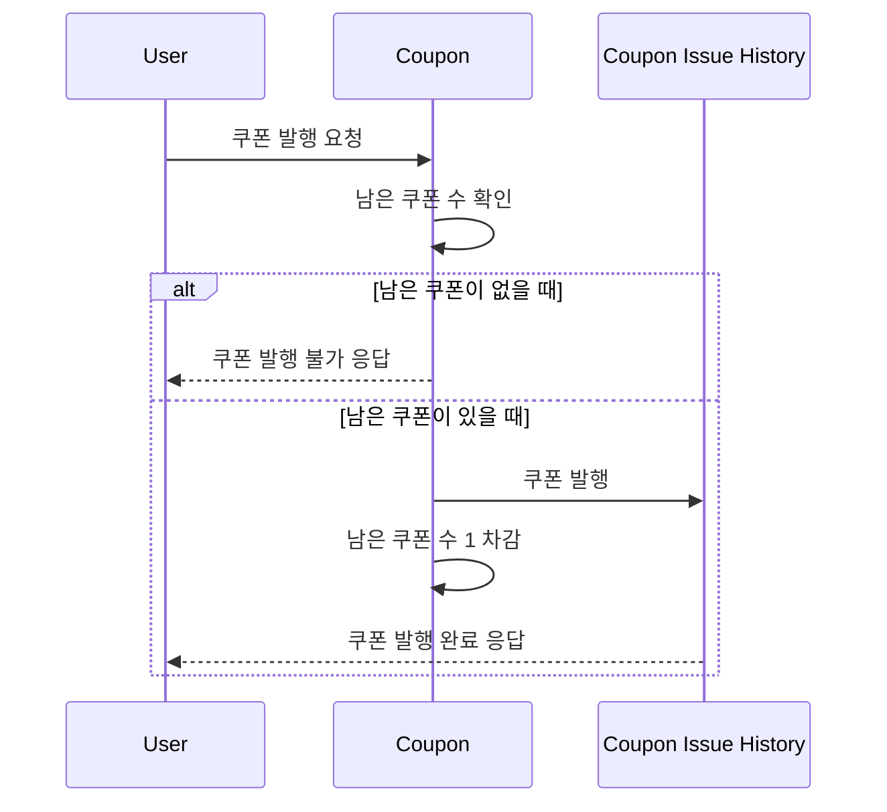
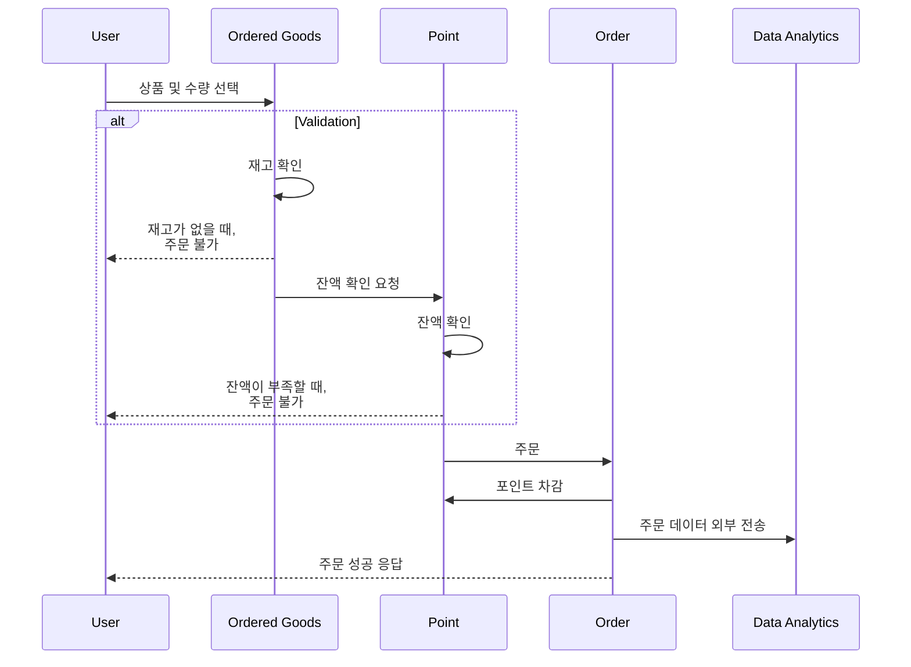

## E-COMMERCE SERVICE 프로젝트

## [ERD](https://dbdiagram.io/d/e-commerce-68380c69c07db17e77ae5bb5)

## Sequence Diagram
### Coupon

### Order

## Infrastructure diagram

여러 클라이언트가 서버에 접속하여 상품을 주문할 수 있다.  
주문 데이터는 database에 저장된다.
