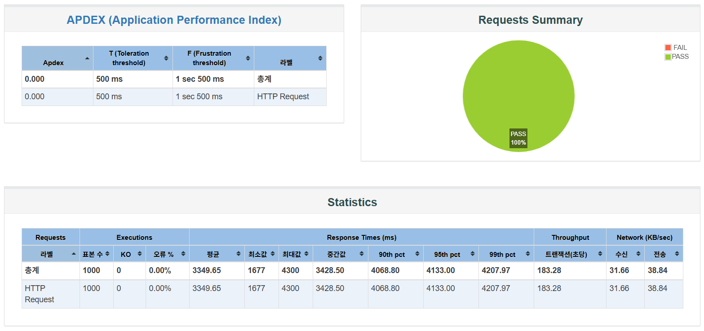
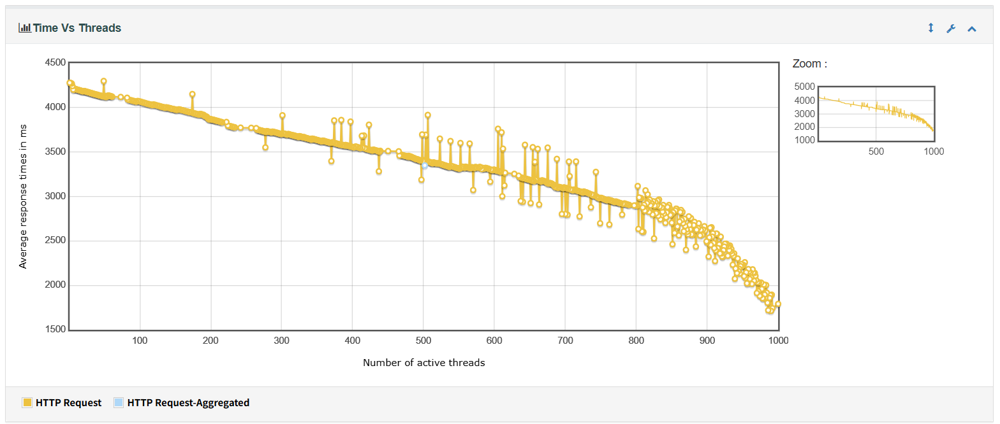
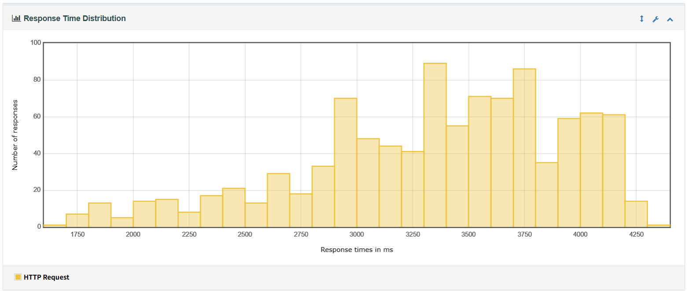

# 기본 부하 테스트 진행

## 부하 테스트대상
선착순 쿠폰 발급

## 부하 테스트 목적
쿠폰은 수량제한이 있어, 여러 사용자의 요청이 동시에 들어올 수 있다. 

- 요청이 몰릴 때 시스템이 안정적으로 처리할 수 있는지 검증한다.
- 실제 발급 수량이 초과되지 않는지 확인한다. 

## 테스트 도구
- JMeter

## 부하 테스트 시나리오

쿠폰 수량이 100개일 때, 1,000명의 사용자가 동시에 발급 요청을 보낸다. 

## 테스트 스크립트
```
jmeter -n -t coupon_HTTP_Request.jmx -l results.jtl -e -o ./report
```

## 실행 결과
### Summary


### Time vs Thread.png


### Response Time Distribution
